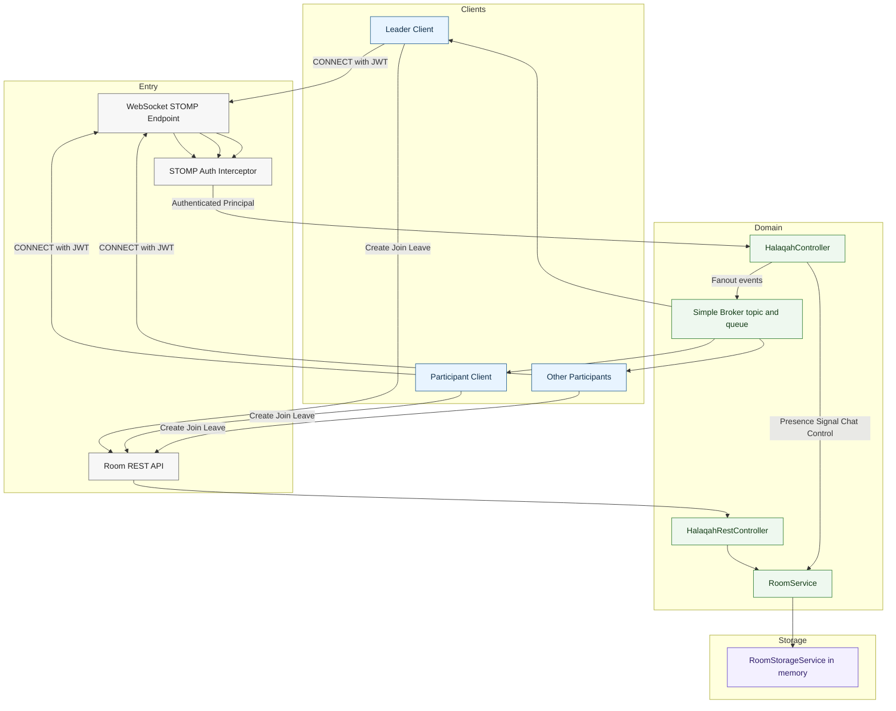

# System Architecture

The feature is split into two planes:

- Lifecycle plane: room create, join, leave, and fetch via REST
- Realtime plane: presence, chat, control, and WebRTC signaling via STOMP

