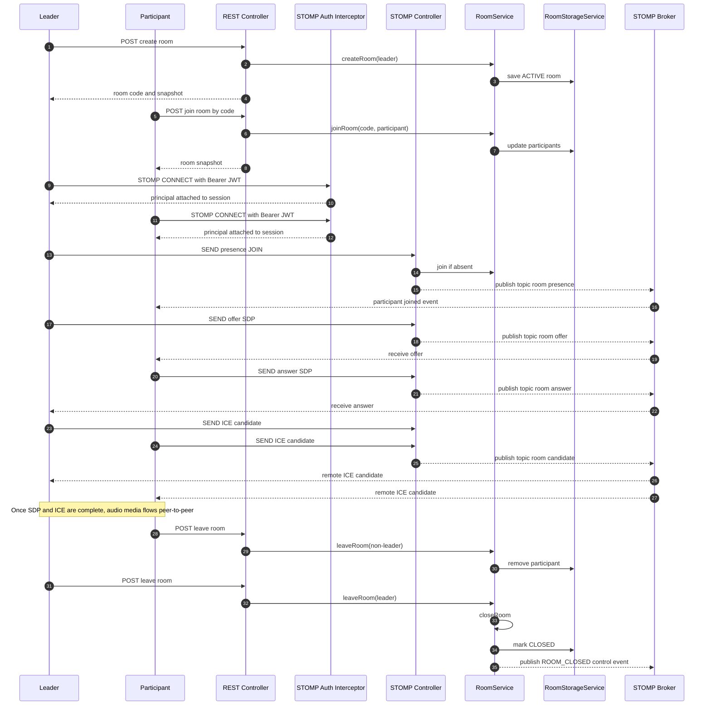

# End-to-End Runtime Sequence

This sequence shows a typical call from room creation to peer-to-peer audio establishment.

```mermaid
sequenceDiagram
  autonumber
  participant L as Leader
  participant P as Participant
  participant R as REST Controller
  participant W as STOMP Auth Interceptor
  participant H as STOMP Controller
  participant S as RoomService
  participant D as RoomStorageService
  participant B as STOMP Broker

  L->>R: POST create room
  R->>S: createRoom(leader)
  S->>D: save ACTIVE room
  R-->>L: room code and snapshot

  P->>R: POST join room by code
  R->>S: joinRoom(code, participant)
  S->>D: update participants
  R-->>P: room snapshot

  L->>W: STOMP CONNECT with Bearer JWT
  W-->>L: principal attached to session
  P->>W: STOMP CONNECT with Bearer JWT
  W-->>P: principal attached to session

  L->>H: SEND presence JOIN
  H->>S: join if absent
  H-->>B: publish topic room presence
  B-->>P: participant joined event

  L->>H: SEND offer SDP
  H-->>B: publish topic room offer
  B-->>P: receive offer

  P->>H: SEND answer SDP
  H-->>B: publish topic room answer
  B-->>L: receive answer

  L->>H: SEND ICE candidate
  P->>H: SEND ICE candidate
  H-->>B: publish topic room candidate
  B-->>L: remote ICE candidate
  B-->>P: remote ICE candidate

  Note over L,P: Once SDP and ICE are complete, audio media flows peer-to-peer

  P->>R: POST leave room
  R->>S: leaveRoom(non-leader)
  S->>D: remove participant

  L->>R: POST leave room
  R->>S: leaveRoom(leader)
  S->>S: closeRoom
  S->>D: mark CLOSED
  S-->>B: publish ROOM_CLOSED control event
```
