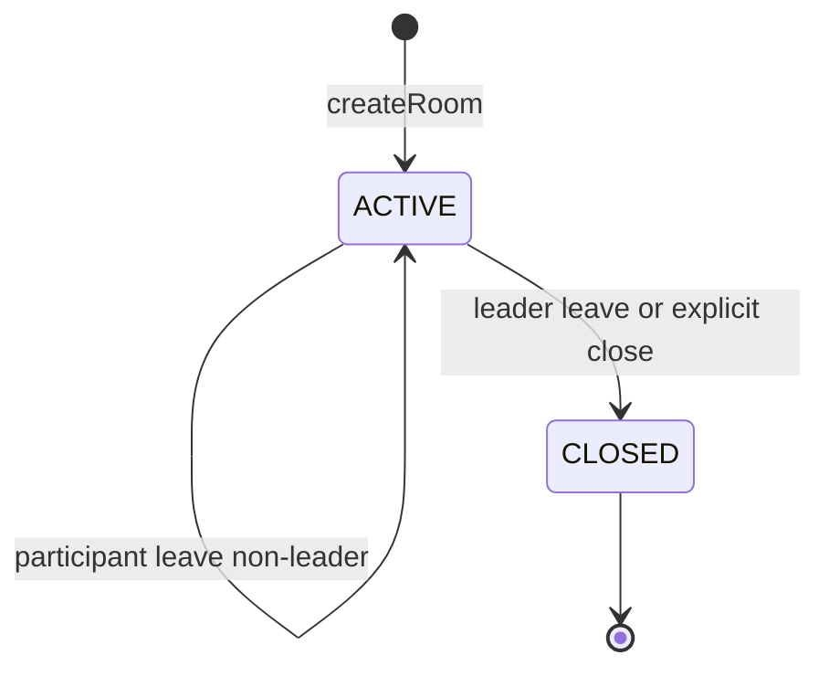

# Room State Machine

The room has a compact lifecycle with ACTIVE and CLOSED states.

## Notes

- Signaling and collaboration messages are accepted only for active rooms.
- Leader departure transitions the room to CLOSED and emits a ROOM_CLOSED control message.
