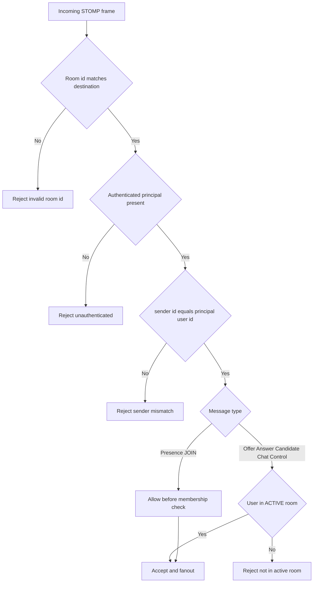

# Validation and Security Gates

Incoming STOMP messages pass through identity, integrity, and membership checks.

## Guard locations

- CONNECT and principal attach in [WebSocketAuthInterceptor](../../src/main/java/com/ks/bayyinah/bayyinah_server/middleware/WebSocketAuthInterceptor.java)
- Per-message validation in [HalaqahController](../../src/main/java/com/ks/bayyinah/bayyinah_server/controller/HalaqahController.java)
- Active membership check in [RoomService](../../src/main/java/com/ks/bayyinah/bayyinah_server/service/RoomService.java)
