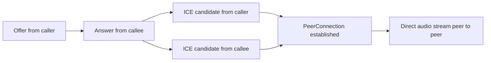

# WebRTC Signaling Contract

The backend acts as a signaling relay, not a media relay.

## Destination conventions

- Client send destinations:
  - /app/room/{roomId}/offer
  - /app/room/{roomId}/answer
  - /app/room/{roomId}/candidate
  - /app/room/{roomId}/presence
  - /app/room/{roomId}/chat
  - /app/room/{roomId}/control

- Broker fanout destinations:
  - /topic/room/{roomId}/offer
  - /topic/room/{roomId}/answer
  - /topic/room/{roomId}/candidate
  - /topic/room/{roomId}/presence
  - /topic/room/{roomId}/chat
  - /topic/room/{roomId}/control

## Important behavior

- The room topic is broadcast-oriented, so clients must filter and route signaling payloads by sender and peer context.
- Media remains peer-to-peer after signaling completion.
