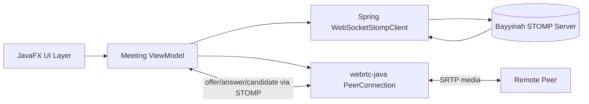
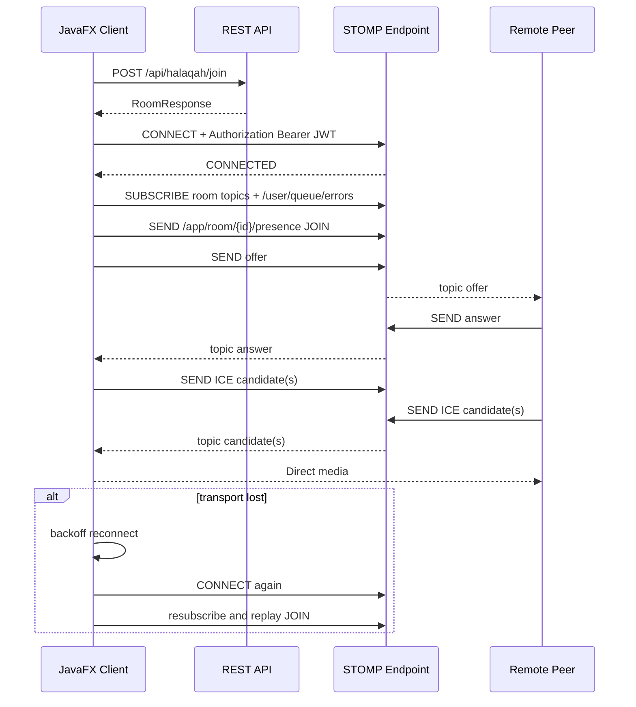

# JavaFX Client Research: WebRTC + STOMP

This document evaluates Java-compatible WebRTC and STOMP client options for a JavaFX app, then maps them to the current Bayyinah server contract.

## Scope and constraints

- Target app: JavaFX desktop client
- Signaling transport: STOMP over WebSocket
- Media transport: WebRTC peer to peer
- Server contract source:
  - STOMP handlers in `HalaqahController`
  - REST room lifecycle in `HalaqahRestController`
  - Auth interceptor in `WebSocketAuthInterceptor`
  - Broker configuration in `WebSocketBrokerConfiguration`

## Bayyinah server contract the client must satisfy

## Endpoint and broker basics

- STOMP endpoint: `/ws` (SockJS enabled)
- Application destination prefix: `/app`
- Broker destinations: `/topic`, `/queue`
- User destination prefix: `/user`

## Authentication and identity rules

- STOMP `CONNECT` must include native header:
  - `Authorization: Bearer <jwt>`
- Every app message must pass identity checks:
  - Destination `{roomId}` must equal payload `roomId`
  - Authenticated user id must equal payload `senderId`
- For signaling/chat/control, sender must already be in an active room.
- Presence `JOIN` is the only flow that can establish membership over STOMP.

## Destinations

- Client sends to:
  - `/app/room/{roomId}/presence`
  - `/app/room/{roomId}/offer`
  - `/app/room/{roomId}/answer`
  - `/app/room/{roomId}/candidate`
  - `/app/room/{roomId}/chat`
  - `/app/room/{roomId}/control`
- Client subscribes to:
  - `/topic/room/{roomId}/presence`
  - `/topic/room/{roomId}/offer`
  - `/topic/room/{roomId}/answer`
  - `/topic/room/{roomId}/candidate`
  - `/topic/room/{roomId}/chat`
  - `/topic/room/{roomId}/control`
  - `/user/queue/errors`

## Payload schemas used by server

### Presence

```json
{
	"roomId": "123456",
	"senderId": "42",
	"type": "JOIN",
	"displayName": "User A"
}
```

- `type`: `JOIN` or `LEAVE`
- `JOIN` adds participant if absent
- `LEAVE` removes participant if present, otherwise server returns validation error

### SDP offer or answer

```json
{
	"type": "OFFER",
	"senderId": "42",
	"roomId": "123456",
	"sdp": "v=0\r\n..."
}
```

- `type`: `OFFER` or `ANSWER`

### ICE candidate

```json
{
	"senderId": "42",
	"roomId": "123456",
	"candidate": "candidate:...",
	"sdpMid": "0",
	"sdpMLineIndex": 0
}
```

### Chat

```json
{
	"roomId": "123456",
	"senderId": "42",
	"displayName": "User A",
	"content": "Assalamu alaikum",
	"timestamp": "1736102542000"
}
```

### Control

```json
{
	"type": "VERSE_NAVIGATION",
	"roomId": "123456",
	"senderId": "42",
	"content": "{\"surah\":2,\"ayah\":255}",
	"timestamp": "1736102542000"
}
```

- Allowed `type` values: `MUTE`, `UNMUTE`, `VERSE_NAVIGATION`, `KICK`, `ROOM_CLOSED`
- `VERSE_NAVIGATION` is leader-only (server-enforced)

### User error queue

```json
{
	"type": "SECURITY_ERROR",
	"message": "Sender ID mismatch"
}
```

- Returned on `/user/queue/errors`
- Known `type`: `SECURITY_ERROR`, `VALIDATION_ERROR`, `SERVER_ERROR`

## WebRTC Java options for JavaFX

## Option A: `dev.onvoid.webrtc:webrtc-java` (recommended)

### Why this is the best fit

- Purpose-built Java bindings for native WebRTC desktop usage
- Cross-platform desktop support documented (Windows, macOS, Linux; multiple architectures)
- Active upstream and recent releases
- Includes examples for peer connection, desktop capture, and web signaling interop

### Evidence snapshot

- Maven coordinates: `dev.onvoid.webrtc:webrtc-java`
- Maven metadata includes `0.14.0`
- `0.14.0` artifact is available on Maven Central
- Native classifier artifacts available:
  - `windows-x86_64`
  - `macos-x86_64`
  - `macos-aarch64`
  - `linux-x86_64`
  - `linux-aarch64`
  - `linux-aarch32`

### Integration notes for JavaFX

- `VideoTrackSink` callback gives `VideoFrame`
- `VideoFrame` is ref-counted (`retain` and `release`), so release is mandatory
- `VideoFrameBuffer.toI420()` is available for conversion pipeline
- `I420Buffer` exposes Y/U/V planes via `ByteBuffer` (`getDataY/U/V`, `getStrideY/U/V`)

Practical rendering pipeline:

1. Receive `VideoFrame` in `onVideoFrame`
2. Convert `frame.buffer.toI420()`
3. Convert I420 to BGRA/ARGB for JavaFX image buffer
4. Push UI update via JavaFX thread handoff
5. Release native buffers (`i420.release()`, `frame.release()`)

## Option B: Embed browser engine and use JavaScript WebRTC

Examples: JavaFX `WebView`, JCEF, or JxBrowser host with browser-side WebRTC stack.

When this is useful:

- You need maximum browser parity quickly
- You already have mature JS signaling and media logic
- You want to reduce JNI media rendering work in Java code

Tradeoffs:

- Heavier runtime and packaging complexity
- Two-language debugging surface (Java + JS)
- Harder desktop-native media pipeline customization

## Option C: Other JVM WebRTC artifacts

Many Maven results named `webrtc` are Android forks or domain-specific distributions and are not ideal generic JavaFX desktop choices.

Decision: use Option A unless there is a strict requirement to run browser code directly.

## STOMP client options for JavaFX

## Option A: Spring STOMP client stack (recommended)

- Core class: `WebSocketStompClient`
- Transport choices:
  - `StandardWebSocketClient` for native WebSocket
  - `SockJsClient` when HTTP fallback behavior is required
- Strong protocol support:
  - Heartbeats
  - Receipts
  - Frame handlers and typed payload conversion
  - Inbound and outbound message size limits

### Why this fits Bayyinah best

- Server is already Spring STOMP and destination conventions map directly
- Authentication header handling is straightforward for `CONNECT`
- Robust error callback points (`handleException`, `handleTransportError`, ERROR frame handling)

## Option B: Raw JDK WebSocket + custom STOMP codec

Use `java.net.http.WebSocket` and implement STOMP framing yourself.

Pros:

- Minimal dependencies
- Full protocol control

Cons:

- You must implement parsing, heartbeats, receipts, reconnect, subscriptions, and frame edge cases
- Higher defect risk and maintenance burden

## Option C: Legacy STOMP libraries

Several artifacts exist but show weak maintenance signals for modern JavaFX desktop use.

Observed examples from Maven metadata:

- `org.projectodd.stilts:stilts-stomp-client` last release line in 2013
- `net.xp-forge:stomp` last release line in 2013
- `org.codehaus.stomp:stompconnect` last release line in 2007

Decision: avoid legacy STOMP libraries for this project.

## Recommended stack for Bayyinah JavaFX client

## Final recommendation

- WebRTC: `dev.onvoid.webrtc:webrtc-java`
- STOMP signaling: Spring `WebSocketStompClient`
- WebSocket runtime (desktop): `StandardWebSocketClient` plus Jakarta client implementation (for example Tyrus)
- JSON serialization: Jackson

## Suggested Maven dependencies

```xml
<dependencies>
  <dependency>
    <groupId>dev.onvoid.webrtc</groupId>
    <artifactId>webrtc-java</artifactId>
    <version>0.14.0</version>
  </dependency>

  <dependency>
    <groupId>org.springframework</groupId>
    <artifactId>spring-websocket</artifactId>
    <version>7.0.6</version>
  </dependency>
  <dependency>
    <groupId>org.springframework</groupId>
    <artifactId>spring-messaging</artifactId>
    <version>7.0.6</version>
  </dependency>

  <dependency>
    <groupId>org.glassfish.tyrus.bundles</groupId>
    <artifactId>tyrus-standalone-client</artifactId>
    <version>2.2.2</version>
  </dependency>

  <dependency>
    <groupId>com.fasterxml.jackson.core</groupId>
    <artifactId>jackson-databind</artifactId>
  </dependency>
</dependencies>
```

If you build a single-platform package, you can pin `webrtc-java` classifier explicitly.

## High-level architecture



## Runtime sequence with reconnect points



## Implementation details that matter in JavaFX

## Threading model

- STOMP callbacks and WebRTC callbacks are not guaranteed to be on JavaFX UI thread.
- Keep three execution lanes:
  - UI thread: view updates only
  - Signaling executor: STOMP session operations and state machine
  - Media executor: frame conversion and heavy media work
- Never block callback threads with expensive conversion or I/O.

## Session state machine guidance

- Track these independent states:
  - STOMP connection: `DISCONNECTED`, `CONNECTING`, `CONNECTED`
  - Room membership: `NOT_JOINED`, `JOINING`, `JOINED`
  - Peer connection: `NEW`, `NEGOTIATING`, `CONNECTED`, `FAILED`, `CLOSED`
- Gate outbound signaling on both conditions:
  - STOMP is `CONNECTED`
  - Room is `JOINED`

## Heartbeats, receipts, and limits

- Configure `TaskScheduler` for heartbeats and receipt tracking
- Keep heartbeat around 10s/10s unless mobile or poor network tuning demands otherwise
- Enable receipts for critical operations where delivery confirmation matters
- Keep message size limits explicit to avoid accidental large payload failures

## Reconnect strategy

- Use exponential backoff with jitter (for example 1s, 2s, 4s, 8s, max 30s)
- On reconnect success:
  1. resubscribe all destinations
  2. re-send presence `JOIN`
  3. if call was active, trigger renegotiation
- Ignore stale signaling by checking room id and expected peer context

## Room lifecycle order for correct behavior

Use this order to minimize server-side rejections:

1. REST `create` or `join`
2. STOMP `CONNECT` with JWT
3. Subscribe all room topics and `/user/queue/errors`
4. Send presence `JOIN`
5. Start offer/answer/candidate exchange
6. Send chat and control as needed
7. Send presence `LEAVE` and REST `leave`

## Security and validation checklist

- Always derive `senderId` from authenticated app user context, not UI input
- Reject sending when local user id and payload `senderId` do not match
- Subscribe to `/user/queue/errors` immediately after connect
- Treat `SECURITY_ERROR` and `VALIDATION_ERROR` as actionable UI signals
- Do not assume STOMP reconnect implies room membership; replay presence `JOIN`

## Risks and mitigations

- Risk: native media resource leaks
  - Mitigation: always release `VideoFrame` and derived buffers
- Risk: race between reconnect and pending signaling
  - Mitigation: queue outbound signaling while disconnected, flush after rejoin
- Risk: callback-thread UI mutations
  - Mitigation: route UI updates through JavaFX-safe handoff
- Risk: leader-only control misuse
  - Mitigation: local role checks before sending `VERSE_NAVIGATION`

## Reference links used in this research

- Spring STOMP client reference and Javadocs
- STOMP 1.2 specification
- RFC 6455 (WebSocket)
- WebRTC official signaling and peer connection guides
- `webrtc-java` docs (`jrtc.dev`), Javadocs, and Maven metadata
